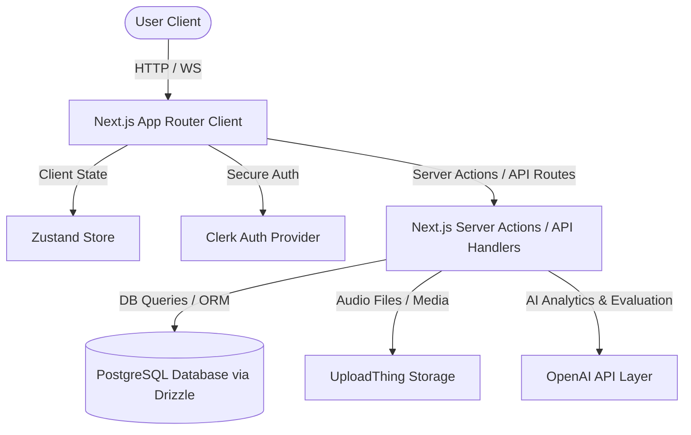

# Implementation Plan - LinguaTrack AI

LinguaTrack AI is an AI-powered multilingual English learning SaaS platform. It helps users analyze their English level (CEFR/IELTS) and improve their vocabulary, reading, writing, speaking, grammar, and listening skills with personalized recommendations.

---

## 1. System Architecture

LinguaTrack AI is built on a scalable, production-ready full-stack architecture using Next.js 15/16 App Router, Tailwind CSS, shadcn/ui, Zustand, Clerk, PostgreSQL, Drizzle ORM, and the OpenAI API.



### Key Architectural Pillars
1. **Dynamic Localization (i18n)**: Locale routing mapped via `/[lang]` path parameter. Native language translation strings are loaded dynamically on the server based on the route language parameter. User-specific translations are backed by DB-stored records for vocabulary definitions.
2. **Next.js 16 Async Request APIs**: Compliance with the latest Next.js 16 updates. All instances of `cookies()`, `headers()`, `params`, and `searchParams` are accessed asynchronously with `await`.
3. **Optimistic Routing with `proxy.ts`**: Handles redirection, checks auth states via Clerk, parses `Accept-Language` headers to detect locale, and prefixes URLs as needed.
4. **Structured AI Evaluation Layer**: Utilizes the OpenAI SDK with JSON schema validation (`beta.chat.completions.parse` / Zod schemas) to ensure consistent structured feedback for essay reviews, placement tests, and speaking assessments.
5. **State Management**: Zustand handles lightweight frontend transient states (e.g., active audio recorder session, UI state, sidebar collapse), while Server Components handle static page data fetching.

---

## 2. Folder Structure

The complete Next.js directory structure:

```txt
├── app/
│   ├── [lang]/
│   │   ├── (auth)/
│   │   │   ├── sign-in/[[...sign-in]]/
│   │   │   │   └── page.tsx           # Clerk Sign In
│   │   │   └── sign-up/[[...sign-up]]/
│   │   │       └── page.tsx           # Clerk Sign Up
│   │   ├── (dashboard)/
│   │   │   ├── dashboard/
│   │   │   │   └── page.tsx           # Analytics Dashboard
│   │   │   ├── vocabulary/
│   │   │   │   └── page.tsx           # Spaced Repetition Flashcards & Word Bank
│   │   │   ├── reading/
│   │   │   │   └── page.tsx           # Reading passages with timer
│   │   │   ├── writing/
│   │   │   │   └── page.tsx           # Essay writer & inline grammar review
│   │   │   ├── speaking/
│   │   │   │   └── page.tsx           # Speech recorder and evaluation
│   │   │   ├── listening/
│   │   │   │   └── page.tsx           # Listening tests & audio player
│   │   │   ├── settings/
│   │   │   │   └── page.tsx           # Account preferences (timezone, theme)
│   │   │   └── layout.tsx             # Dashboard Sidebar & Navbar Navigation
│   │   ├── onboarding/
│   │   │   └── page.tsx               # Native lang selection, target level & placement
│   │   ├── layout.tsx                 # Base App Provider container (Theme, i18n, Clerk)
│   │   └── page.tsx                   # Dark-themed Landing Page
│   └── api/
│       ├── uploadthing/
│       │   └── route.ts               # File upload route
│       └── speaking/
│           └── evaluate/
│               └── route.ts           # Speech evaluation API endpoint
├── components/
│   ├── ui/                            # Auto-generated shadcn components
│   ├── shared/
│   │   ├── theme-toggle.tsx
│   │   └── translation-provider.tsx
│   ├── dashboard/
│   │   ├── overview-charts.tsx
│   │   └── recommendations.tsx
│   ├── writing/
│   │   └── inline-feedback.tsx
│   └── speaking/
│       └── audio-recorder.tsx
├── db/
│   ├── schema.ts                      # Full Drizzle Schema
│   ├── index.ts                       # Database client exports
│   └── seed.ts                        # Prepopulated questions & dictionary entries
├── hooks/
│   ├── use-store.ts                   # Zustand hook
│   └── use-translation.ts             # Client-side dictionary hook
├── lib/
│   ├── open-ai.ts                     # OpenAI client and structured parsing
│   ├── utils.ts                       # Tailwind helper merges
│   └── i18n.ts                        # Dictionary definitions and helper functions
├── types/
│   └── index.ts                       # Standard TS Interfaces
├── actions/
│   ├── user.ts                        # Onboarding, Profile updates
│   ├── practice.ts                    # Scoring, Writing submit, Reading attempts
│   └── settings.ts                    # Settings mutations
├── proxy.ts                           # Next.js 16 Proxy Router
├── package.json
└── tailwind.config.ts
```

---

## 3. Database Schema

We define the complete Drizzle ORM PostgreSQL schema. It contains indexes, foreign keys, and fields matching all modules.

```typescript
// db/schema.ts
import { 
  pgTable, 
  uuid, 
  text, 
  integer, 
  boolean, 
  timestamp, 
  real, 
  jsonb, 
  pgEnum 
} from "drizzle-orm/pg-core";
import { relations } from "drizzle-orm";

// Enums
export const practiceTypeEnum = pgEnum("practice_type", [
  "reading", "writing", "speaking", "grammar", "listening", "vocabulary"
]);
export const recommendationTypeEnum = pgEnum("recommendation_type", [
  "daily_plan", "weak_area", "feedback"
]);

// Users
export const users = pgTable("users", {
  id: uuid("id").primaryKey().defaultRandom(),
  clerkId: text("clerk_id").notNull().unique(),
  email: text("email").notNull(),
  name: text("name"),
  preferredLanguage: text("preferred_language").default("en"),
  learningLanguage: text("learning_language").default("en"),
  target: text("target"), // IELTS, TOEFL, GRE, General English, Business English
  timezone: text("timezone").default("UTC"),
  country: text("country"),
  completedOnboarding: boolean("completed_onboarding").default(false),
  estimatedIeltsBand: real("estimated_ielts_band"),
  cefrLevel: text("cefr_level"), // A1, A2, B1, B2, C1, C2
  createdAt: timestamp("created_at").defaultNow().notNull(),
  updatedAt: timestamp("updated_at").defaultNow().notNull(),
});

// Practice Sessions
export const practiceSessions = pgTable("practice_sessions", {
  id: uuid("id").primaryKey().defaultRandom(),
  userId: uuid("user_id").references(() => users.id, { onDelete: "cascade" }).notNull(),
  type: practiceTypeEnum("type").notNull(),
  score: integer("score"),
  duration: integer("duration"), // in seconds
  createdAt: timestamp("created_at").defaultNow().notNull(),
});

// Reading Attempts
export const readingAttempts = pgTable("reading_attempts", {
  id: uuid("id").primaryKey().defaultRandom(),
  userId: uuid("user_id").references(() => users.id, { onDelete: "cascade" }).notNull(),
  passageId: text("passage_id").notNull(),
  answers: jsonb("answers").notNull(),
  score: integer("score").notNull(),
  speed: integer("speed").notNull(), // WPM
  accuracy: integer("accuracy").notNull(), // percentage
  aiFeedback: text("ai_feedback"),
  createdAt: timestamp("created_at").defaultNow().notNull(),
});

// Writing Attempts
export const writingAttempts = pgTable("writing_attempts", {
  id: uuid("id").primaryKey().defaultRandom(),
  userId: uuid("user_id").references(() => users.id, { onDelete: "cascade" }).notNull(),
  essayText: text("essay_text").notNull(),
  grammarScore: integer("grammar_score").notNull(),
  vocabularyScore: integer("vocabulary_score").notNull(),
  coherenceScore: integer("coherence_score").notNull(),
  estimatedBand: real("estimated_band").notNull(),
  mistakes: jsonb("mistakes").notNull(), // Offset-based inline mistakes highlights
  improvedVersion: text("improved_version").notNull(),
  studyPlan: text("study_plan").notNull(),
  createdAt: timestamp("created_at").defaultNow().notNull(),
});

// Speaking Attempts
export const speakingAttempts = pgTable("speaking_attempts", {
  id: uuid("id").primaryKey().defaultRandom(),
  userId: uuid("user_id").references(() => users.id, { onDelete: "cascade" }).notNull(),
  audioUrl: text("audio_url").notNull(),
  transcript: text("transcript").notNull(),
  fluencyScore: integer("fluency_score").notNull(),
  grammarScore: integer("grammar_score").notNull(),
  pronunciationScore: integer("pronunciation_score").notNull(),
  vocabularyScore: integer("vocabulary_score").notNull(),
  feedback: jsonb("feedback").notNull(),
  createdAt: timestamp("created_at").defaultNow().notNull(),
});

// Grammar Attempts
export const grammarAttempts = pgTable("grammar_attempts", {
  id: uuid("id").primaryKey().defaultRandom(),
  userId: uuid("user_id").references(() => users.id, { onDelete: "cascade" }).notNull(),
  score: integer("score").notNull(),
  totalQuestions: integer("total_questions").notNull(),
  details: jsonb("details").notNull(),
  createdAt: timestamp("created_at").defaultNow().notNull(),
});

// Word Bank (Shared definitions)
export const wordBank = pgTable("word_bank", {
  id: uuid("id").primaryKey().defaultRandom(),
  word: text("word").notNull().unique(),
  ipa: text("ipa"),
  definition: text("definition").notNull(),
  translatedDefinitions: jsonb("translated_definitions").notNull(), // e.g. { "bn": "সহনশীল", "ja": "回復力のある" }
  exampleSentence: text("example_sentence").notNull(),
  translatedSentences: jsonb("translated_sentences").notNull(),
  synonyms: jsonb("synonyms").notNull(), // string[]
  antonyms: jsonb("antonyms").notNull(), // string[]
  difficulty: text("difficulty").notNull(), // easy, medium, hard
  usageFrequency: real("usage_frequency"),
  audioUrl: text("audio_url"),
  createdAt: timestamp("created_at").defaultNow().notNull(),
});

// Vocabulary Progress (Spaced Repetition per User)
export const vocabularyProgress = pgTable("vocabulary_progress", {
  id: uuid("id").primaryKey().defaultRandom(),
  userId: uuid("user_id").references(() => users.id, { onDelete: "cascade" }).notNull(),
  wordId: uuid("word_id").references(() => wordBank.id, { onDelete: "cascade" }).notNull(),
  level: integer("level").default(0).notNull(), // Interval status
  easeFactor: real("ease_factor").default(2.5).notNull(),
  interval: integer("interval").default(0).notNull(), // in days
  repetitions: integer("repetitions").default(0).notNull(),
  nextReviewDate: timestamp("next_review_date").defaultNow().notNull(),
  lastReviewedDate: timestamp("last_reviewed_date"),
  isFavorite: boolean("is_favorite").default(false).notNull(),
  createdAt: timestamp("created_at").defaultNow().notNull(),
});

// Recommendations
export const recommendations = pgTable("recommendations", {
  id: uuid("id").primaryKey().defaultRandom(),
  userId: uuid("user_id").references(() => users.id, { onDelete: "cascade" }).notNull(),
  type: recommendationTypeEnum("type").notNull(),
  data: jsonb("data").notNull(), // Generated daily schedule / weaknesses
  isCompleted: boolean("is_completed").default(false).notNull(),
  createdAt: timestamp("created_at").defaultNow().notNull(),
  expiresAt: timestamp("expires_at").notNull(),
});

// Study Streak
export const studyStreaks = pgTable("study_streaks", {
  id: uuid("id").primaryKey().defaultRandom(),
  userId: uuid("user_id").references(() => users.id, { onDelete: "cascade" }).notNull().unique(),
  currentStreak: integer("current_streak").default(0).notNull(),
  longestStreak: integer("longest_streak").default(0).notNull(),
  lastActiveDate: timestamp("last_active_date"),
  createdAt: timestamp("created_at").defaultNow().notNull(),
});

// Analytics Daily Summary
export const analytics = pgTable("analytics", {
  id: uuid("id").primaryKey().defaultRandom(),
  userId: uuid("user_id").references(() => users.id, { onDelete: "cascade" }).notNull(),
  dailyScore: integer("daily_score").default(0).notNull(),
  weeklyScore: integer("weekly_score").default(0).notNull(),
  monthlyScore: integer("monthly_score").default(0).notNull(),
  vocabularyGrowth: integer("vocabulary_growth").default(0).notNull(),
  estimatedBand: real("estimated_band"),
  trend: text("trend"), // "improving", "decline", "stable"
  createdAt: timestamp("created_at").defaultNow().notNull(),
});

// Study Plans
export const studyPlans = pgTable("study_plans", {
  id: uuid("id").primaryKey().defaultRandom(),
  userId: uuid("user_id").references(() => users.id, { onDelete: "cascade" }).notNull(),
  title: text("title").notNull(),
  description: text("description"),
  tasks: jsonb("tasks").notNull(), // Array of tasks
  isCompleted: boolean("is_completed").default(false).notNull(),
  targetDate: timestamp("target_date"),
  createdAt: timestamp("created_at").defaultNow().notNull(),
});

// Notifications
export const notifications = pgTable("notifications", {
  id: uuid("id").primaryKey().defaultRandom(),
  userId: uuid("user_id").references(() => users.id, { onDelete: "cascade" }).notNull(),
  title: text("title").notNull(),
  message: text("message").notNull(),
  type: text("type").default("info").notNull(), // "info", "warning", "success"
  read: boolean("read").default(false).notNull(),
  createdAt: timestamp("created_at").defaultNow().notNull(),
});

// Indexes for optimal query speed
// (Included in DB setup phase, defined inside migrations)
```

---

## 4. Authentication (Clerk Integration)

Authentication is handled securely with Clerk. 

- **Session Handling**: Protected via Server Actions and route security checks in `proxy.ts`.
- **Database Synchronization**: A webhook handles synchronizing user status (sign-up/delete) directly into our local database `users` table.
- **Middleware Boundary**: `proxy.ts` checks `clerkMiddleware()` helper to assert session status before resolving localized dynamic dashboards.

---

## 5. UI Layout

The design layout supports a dark-mode premium feel. Harmonious palette selection:
- Dark background: HSL 224 71% 4% (zinc-950/indigo-950)
- Neon primary accents: HSL 263 90% 50% (purple-500)
- Border structures: Glassmorphism (`backdrop-blur` with semi-transparent borders).

### Global Layout Structure
- **Navigation (Sidebar)**: Links to Dashboard, Vocab bank, Practice tests (Reading, Writing, Speaking, Listening), Settings.
- **Navbar Headers**: Fast switching between Preferred translation languages, quick access to Streak counter, user profile.

---

## 6. API Design

API interaction is managed via **REST API Routes** for streaming/audio files, and **Server Actions** for transactions.

- `/api/speaking/evaluate`: Endpoint containing OpenAI transcription (Whisper) and assessment logic.
- `/api/uploadthing`: Manages speak upload configuration.
- **Server Actions (`actions/`)**:
  - `completeOnboardingAction(data)`: Validates native language, target test type, and updates CEFR estimations.
  - `submitEssayAction(text)`: Takes raw writing input, triggers OpenAI API analysis, inserts writing record, updates analytics.
  - `reviewFlashcardAction(wordId, rating)`: Calculates next review date based on SuperMemo-2 algorithm.

---

## 7. AI Layer Service

Encapsulated services using OpenAI's structured outputs (`beta.chat.completions.parse`).

### Structured Zod Schemas
```typescript
import { z } from "zod";

export const PlacementTestSchema = z.object({
  cefrLevel: z.enum(["A1", "A2", "B1", "B2", "C1", "C2"]),
  estimatedIeltsBand: z.number().min(1.0).max(9.0),
  strengths: z.array(z.string()),
  weaknesses: z.array(z.string()),
  studyRecommendation: z.string(),
});

export const WritingEvaluationSchema = z.object({
  grammarScore: z.number().min(0).max(100),
  vocabularyScore: z.number().min(0).max(100),
  coherenceScore: z.number().min(0).max(100),
  estimatedBand: z.number().min(1.0).max(9.0),
  mistakes: z.array(z.object({
    originalText: z.string(),
    improvedText: z.string(),
    explanation: z.string(),
    startIndex: z.number(),
    endIndex: z.number(),
  })),
  improvedVersion: z.string(),
  studyPlan: z.string(),
});

export const SpeakingEvaluationSchema = z.object({
  fluencyScore: z.number().min(0).max(100),
  grammarScore: z.number().min(0).max(100),
  pronunciationScore: z.number().min(0).max(100),
  vocabularyScore: z.number().min(0).max(100),
  feedback: z.string(),
});
```

---

## 8. Analytics Dashboard

Recharts provides premium charts inside a dark theme dashboard:
- **Weekly Practice Trend**: Interactive `AreaChart` mapping daily score performance.
- **Skill Map Radar Chart**: Visualizes Reading, Writing, Speaking, and Grammar relative strengths.
- **Vocabulary Growth Over Time**: `LineChart` measuring word bank retention levels.
- **Decline Detection**: Algorithm runs on weekly aggregates; if score averages decline > 15%, a custom warning banner dynamically highlights specific exercises to repeat.

---

## 9. Verification & Testing Plan

### Automated Tests
- Integration tests checking SM2 SuperMemo-2 calculations.
- Schema verification scripts to validate database mapping.

### Manual Verification
- Testing localization fallback logic by modifying `Accept-Language` headers and verify translated words.
- Testing recording, uploading, and evaluating microphone audio in the browser.

---

## 10. Step-by-Step Implementation

1. **Step 1: Setup dependencies** - Install Clerk, Drizzle, UploadThing, Zustand, Lucide-react, Recharts.
2. **Step 2: Database config** - Setup local DB config, drizzle.config.ts, schema declaration. Run migrations.
3. **Step 3: Auth & Onboarding Routing** - Set up Clerk, implement onboarding layout and Placement Test form.
4. **Step 4: Dynamic Localization** - Implement custom dictionary helpers and middleware language detection.
5. **Step 5: Vocabulary & Flashcard SM2 System** - Implement SuperMemo algorithm calculations and review view.
6. **Step 6: Writing Assessment Module** - Construct layout and AI structured response pipeline.
7. **Step 7: Speaking Audio Module** - Implement audio recording in browser, UploadThing integration, Whisper transcription, and AI speaking grading.
8. **Step 8: Reading/Listening Modules** - Prep sample JSON questions, implement timers and grading metrics.
9. **Step 9: Analytics Dashboard** - Integrate Recharts graphs and recommendation banners.
10. **Step 10: Settings & polish** - Implement preferences customization, exports, and UI final touches.

---

## User Review Required

> [!WARNING]
> Next.js 16 deprecated standard `middleware.ts` naming and introduced `proxy.ts`. The edge runtime is not supported inside `proxy`. Since Clerk SDK relies on headers/cookies checks, we will handle authentication checks directly inside Next.js 16's `proxy.ts` or leverage standard async routes in our layout checking.
> Let's make sure this behaves perfectly when deployed.

> [!IMPORTANT]
> The Whisper API requires file uploads. We will use UploadThing to store user spoken files first, and send the uploaded URLs directly to our evaluation endpoint.

## Open Questions

- Should we include standard seeds for dictionaries (Bangla, Japanese, Arabic, Spanish, etc.) inside the migration/seed script?
- Do you have an active Clerk environment key or should we set up dummy/placeholder environment variables for local validation?
